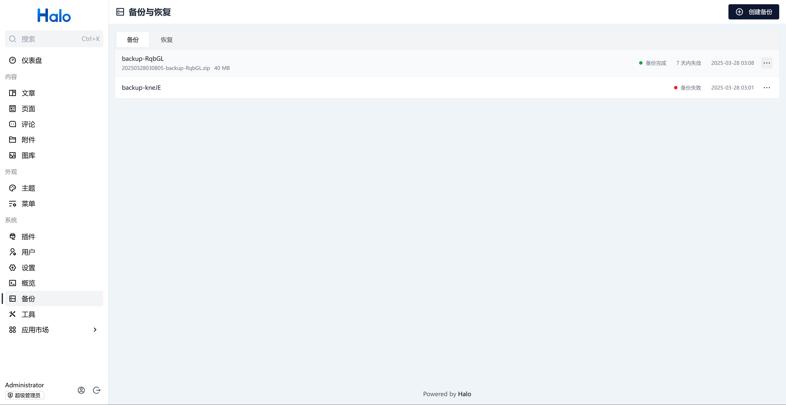
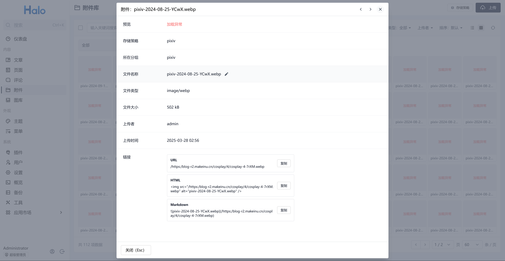
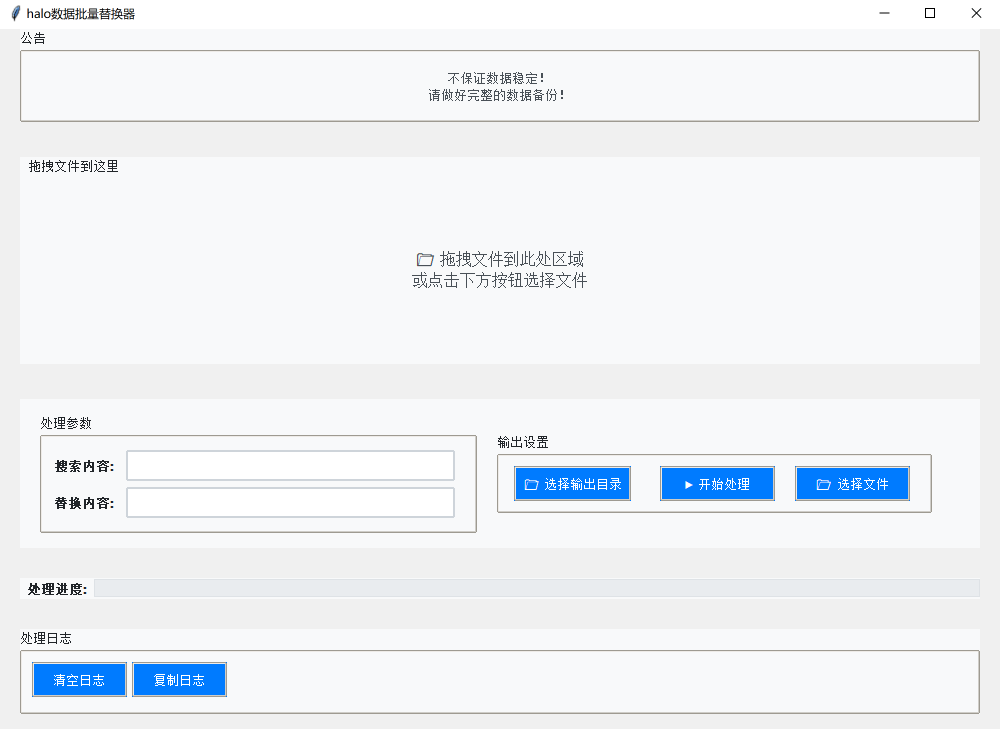

# halo批量替换数据处理器

一个用于处理Base64编码data文件的工具，支持内容查找替换并生成解码副本。

## 感谢

[批量修改文章和其他地方的图片链接](https://github.com/orgs/halo-dev/discussions/6465)

## 准备

- 备份文件

- 下载文件
- 拖出extensions.data

## 注意事项

⚠️ **重要提示**
- 不保证数据稳定性，请务必做好完整备份！
- 复杂的正则表达式可能导致处理失败
- 数据很重要，数据无价，请注意备份！！！！！

### 当前替换后如果使用的是存储在本地的文件则会出现附件库无法显示的问题，如下：

### 但是，前端可以正常显示，如下（此处使用正则表达式替换）：


## 功能特性

- 拖放文件或手动选择文件
- 支持正则表达式查找替换（测试），仅支持多对一替换
- 自动生成原始文件的解码副本
- 实时处理日志显示
- 支持cli功能

## 使用方法

### CLI命令行使用
```bash
python cli.py -i 输入文件 -o 输出文件 -s "搜索内容" -r "替换内容"
```

参数说明:
- `-i/--input`: 输入文件路径(必需)
- `-o/--output`: 输出文件路径(必需)
- `-s/--search`: 搜索内容(支持正则表达式)
- `-r/--replace`: 替换内容

示例:
```bash
python cli.py -i data.json -o processed_data.json -s "test" -r "TEST"
```

### GUI界面使用
1. 将文件拖放到窗口或点击"选择文件"按钮
2. 输入搜索内容(支持正则表达式)
3. 输入替换内容
4. 选择输出目录(默认为输入文件所在目录)
5. 点击"开始处理"按钮

处理完成后会生成两个文件：
- `processed_原文件名.data` - 处理后的文件
- `原文件名-original-decoded.json` - 原始文件的解码副本

## 运行要求

- Python 3.6+
- 需要安装以下依赖：
  ```
  pip install tkinterdnd2
  ```

## 启动方式

```bash
python gui.py
```

## 界面截图



## 许可证

MIT License
