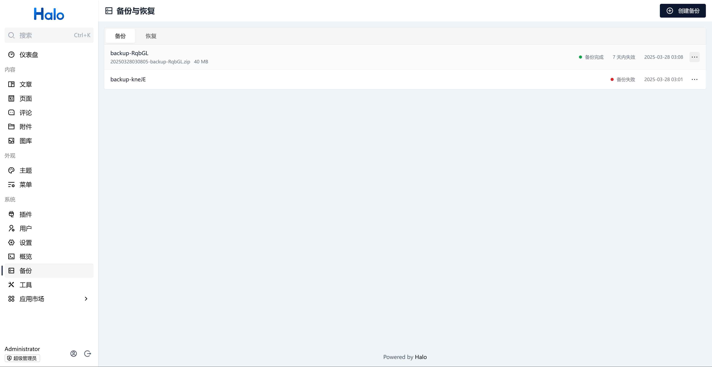
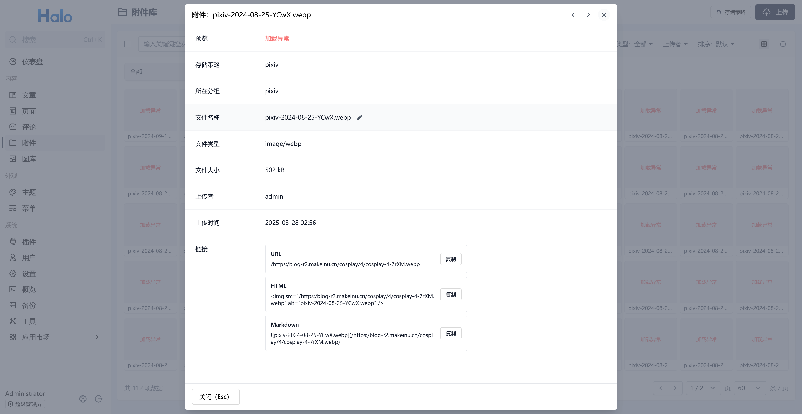
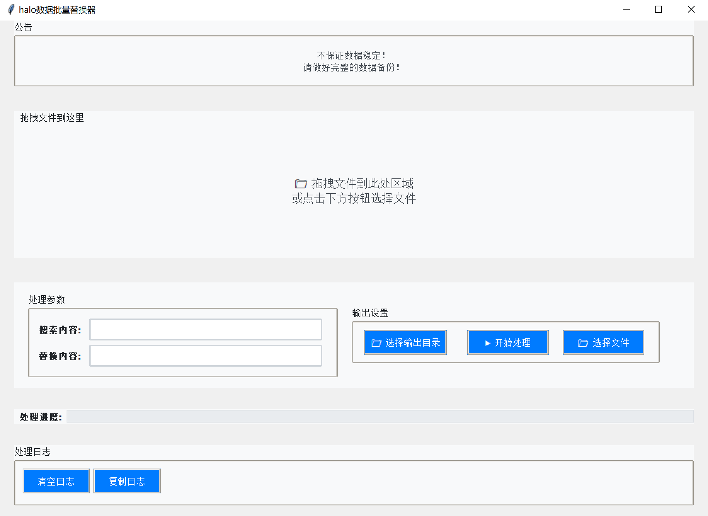

# Halo 批量替换数据处理器

一个用于批量处理 Halo CMS 的 `extensions.data` 文件的工具。Halo 将扩展数据以 Base64 编码的 JSON 格式存储在 `.data` 文件中，本工具支持对这些数据进行解码、查找替换和重新编码。

## 致谢

灵感来源：[批量修改文章和其他地方的图片链接](https://github.com/orgs/halo-dev/discussions/6465)

## 准备

1. **备份文件**（非常重要！）
   
2. 从 Halo 站点下载 `extensions.data` 文件

## ⚠️ 注意事项

- **不保证数据稳定性，请务必做好完整备份！**
- 复杂的正则表达式可能导致处理失败
- 数据无价，请注意备份！！！

### 已知问题

替换后如果使用的是存储在本地的文件，则会出现附件库无法显示的问题：


但前端可以正常显示（此处使用正则表达式替换）：


## 功能特性

- 📂 **拖放文件**或手动选择文件加载
- 🔍 **正则表达式查找替换**（已稳定支持）
- 🎯 **搜索范围控制** — 可精确选择搜索替换的字段范围：
  - 扩展名称 (name)
  - 类型 (kind)
  - 元数据名称 (metadata.name)
  - API 版本 (apiVersion)
  - 数据字段 (data)
  - 规格字段 (spec)
- 🏷️ **类型筛选** — 按扩展类型 (kind) 过滤，仅替换指定类型的数据
- 🔓 **Base64 解码** — 将编码数据解码为可读的 JSON 格式
- 🔒 **Base64 编码** — 将修改后的 JSON 数据重新编码为 Base64 格式
- 📋 **实时处理日志** — 操作过程实时反馈
- 🌗 **深色/浅色主题切换**
- 💻 **双模式操作** — 支持 GUI 图形界面和 CLI 命令行
- 🔄 **自动发布** — 通过 GitHub Actions 自动构建和发布 Windows 可执行文件

## 使用方法

### GUI 图形界面

```bash
python gui.py
```

操作流程：
1. 将 `extensions.data` 文件拖放到窗口，或点击"选择文件"按钮
2. 输入搜索内容（支持正则表达式）
3. 输入替换内容
4. 选择搜索范围和类型筛选
5. 选择输出目录（默认为输入文件所在目录）
6. 点击操作按钮：
   - **解码** — 解码文件，生成可读的 JSON 副本
   - **替换** — 执行查找替换操作
   - **编码** — 将解码后的 JSON 文件重新编码为 Base64 格式
   - **保存** — 保存处理结果

处理完成后会生成文件：
- `processed_原文件名.data` — 处理后的文件
- `reencoded_原文件名.data` — 重新编码后的文件

### CLI 命令行

```bash
python cli.py -i 输入文件 -o 输出文件 -s "搜索内容" -r "替换内容"
```

参数说明：
- `-i/--input`：输入文件路径（必需）
- `-o/--output`：输出文件路径（必需）
- `-s/--search`：搜索内容（支持正则表达式，默认 CLI 模式下启用正则）
- `-r/--replace`：替换内容
- `--reencode`：重新编码解码副本文件的路径

示例：

```bash
# 简单文本替换
python cli.py -i extensions.data -o processed_extensions.data -s "old-domain.com" -r "new-domain.com"

# 正则表达式替换（替换所有 HTTP 链接为 HTTPS）
python cli.py -i extensions.data -o processed_extensions.data -s "http://" -r "https://"

# 重新编码已解码的 JSON 文件
python cli.py --reencode decoded.json -o reencoded.data
```

### 使用示例视频

[![使用示例视频]](./images/2025-05-04%2011-22-27.mp4)

## 界面截图



## 运行要求

- Python 3.10+
- 依赖库：
  ```
  pip install customtkinter tkinterdnd2
  ```

## 项目架构

项目采用分层架构（Clean Architecture）设计：

```
├── modules/
│   ├── domain/                  # 领域层
│   │   ├── entities/            # 实体：Extension, ExtensionData
│   │   ├── repositories/        # 仓储接口：IExtensionRepository, IStorageRepository
│   │   ├── services/            # 领域服务：ExtensionSearchService
│   │   └── value_objects/       # 值对象：SearchQuery, Pagination
│   ├── application/             # 应用层
│   │   ├── use_cases/           # 用例：Load, Export, BatchReplace, Reset, Update, Delete
│   │   ├── decorators/          # 装饰器：Logging, ErrorHandler, Event
│   │   └── shared/              # 共享：Results, Errors
│   ├── infrastructure/          # 基础设施层
│   │   ├── repositories/        # 仓储实现：FileStorageRepository, InMemoryExtensionRepository
│   │   ├── services/            # 服务实现：Base64Decoder, Base64Encoder, DefaultReplaceEngine
│   │   └── types/               # 类型定义：ReplaceRule, ReplaceScope, IReplaceEngine
│   ├── presentation/            # 表现层
│   │   ├── gui/                 # GUI 界面（customtkinter + tkinterdnd2）
│   │   └── cli_app.py           # CLI 命令行界面
│   └── core/                    # 核心层
│       ├── di/                  # 依赖注入容器
│       ├── events/              # 事件总线
│       └── logging/             # 日志
├── di/                          # DI 容器配置
├── gui.py                       # GUI 入口
├── cli.py                       # CLI 入口
└── gui.spec                     # PyInstaller 打包配置
```

### 核心工作流

1. **加载** — `FileStorageRepository` 读取 `.data` 文件 → `Base64Decoder` 解码为 `Extension` 对象 → 存入 `InMemoryExtensionRepository`
2. **替换** — `BatchReplaceUseCase` 调用 `DefaultReplaceEngine`，根据 `ReplaceRule` 和 `ReplaceScope` 在扩展数据中执行查找替换
3. **导出** — `Base64Encoder` 将 `Extension` 对象编码为 Base64 → `FileStorageRepository` 写入文件

## 构建

使用 PyInstaller 构建 Windows 可执行文件：

```bash
pyinstaller gui.spec
```

构建产物位于 `dist/gui.exe`。

## 许可证

MIT License
